# Waze Project

## Waze Churn Prediction Model Project

 
**Note**: _This project is created in partnership between Google Advanced Data Analytics Professional Certificate and the real-time driving directions app, Waze. The story, all names, characters, and incidents portrayed in this project are fictitious. No identification with actual persons (living or deceased) is intended or should be inferred. And the data shared in this project has been created for pedagogical purposes._

## **Project Background**

Waze’s free navigation app makes it easier for drivers around the world to get to where they want to go. Waze’s community of map editors, beta testers, translators, partners, and users helps make each drive better and safer. Waze partners with cities, transportation authorities, broadcasters, businesses, and first responders to help as many people as possible travel more efficiently and safely.
Waze are about to start a new project to help prevent user churn on the Waze app. Churn quantifies the number of users who have uninstalled the Waze app or stopped using the app. This project focuses on monthly user churn. 
This project is part of a larger effort at Waze to increase growth. Typically, high retention rates indicate satisfied users who repeatedly use the Waze app over time. Developing a churn prediction model will help prevent churn, improve user retention, and grow Waze’s business. An accurate model can also help identify specific factors that contribute to churn and answer questions such as: 
-	Who are the users most likely to churn?
-	Why do users churn? 
-	When do users churn?
  
## **Scenario**
## **Step 1 - Project Proposal**
As a data analyst, I will collaborate with my Waze teammates to analyse and interpret data, generate valuable insights, and help leadership make informed business decisions. In my role, I will analyse user data and develop a machine learning model that predicts user churn. 
The insights that the team and I generate will help Waze leadership optimise the company’s retention strategy, enhance user experience, and make data-driven decisions about product development.
For my first assignment, I will be creating a project proposal that will create milestones for the tasks within this project.

**Team members at Waze**

As a new data analyst, I’ll work closely with a talented team of experienced data professionals. I’ll also collaborate with Waze co-workers outside the data team as the project requires. 

**Data team roles**
-	Harriet Hadzic - Director of Data Analysis 
-	May Santner - Data Analysis Manager 
-	Chidi Ga - Senior Data Analyst 
-	Sylvester Esperanza - Senior Project Manager 

**Other roles**
-	Emrick Larson - Finance and Administration Department Head 
-	Ursula Sayo - Operations Manager 

**Workflow Structure**

I will be using the PACE workflow framework throughout this project in order to provide a clear foundation and structure for this data analysis project. PACE is an acronym and each one of the letters represents an actionable stage in a project: plan, analyse, construct, and execute.

 
**Plan Stage**: First, I need to ask and answer some relevant questions for this project. These include:
-	Who is my audience for this project? My audience for this project includes my data team members, as well as the other team members I would be working with.
-	What am I trying to solve or accomplish? And what do I anticipate the impact of this work will be on the larger needs of the client? In this project, we aim to develop a machine learning model to predict user churn on the Waze app by analysing user data and identifying key factors that lead to churn. The impact will be improved user retention, enhanced user experience, and increased business growth through data-driven decision-making and targeted interventions. This will help Waze maintain a competitive edge and support long-term business success.
-	What questions need to be asked or answered? These include:
    -	What are the specific goals and objectives of the churn prediction project?
    -	What is the condition of the provided dataset?
    -	What variables will be the most useful?
    -	Are there trends within the data that can provide insight?
    -	What steps can I take to reduce the impact of bias?
    -	Are there any data quality issues or gaps that need to be addressed?
    -	How will data from different sources be integrated and preprocessed?
    -	What data governance and privacy considerations need to be taken into account?
    -	What machine learning algorithms will be used to develop the churn prediction model?
    -	What metrics will be used to evaluate the model's performance?
    -	What techniques will be used to validate the model's accuracy and reliability?
    -	What are the key factors contributing to user churn?
    -	Who are the users most likely to churn?
    -	What strategies can be implemented to prevent churn and improve user retention?
    -	What type of reports and visualisations will be created to communicate findings?
    -	How will we tailor communication for different stakeholders, including technical and non-technical audiences?
    -	What are the main talking points for the presentation to the leadership team?

-	What resources are required to complete this project?
    - Team members
    - Input from stakeholders
    - Budget/Funding
    - Project Dataset
    - A statistical tool – e.g., Python (Python notebook)

-	What are the deliverables that will need to be created over the course of this project?
  
    - A project proposal
    - Prepared and cleaned datasets
    - Statistical model
    - Regression analysis model
    - Machine learning model
    - Exploratory Data Analysis reports
    - Stakeholder reports
    - Visualizations e.g. dashboard

[Link to Waze Project Proposal](assets/Waze_project_proposal.pdf)

## **Step 2 - Data Cleaning and Organisation**
I have received notice that the project proposal submitted by the team has been approved and we have been given access to Waze’s user data. To get clear insights, the data must be inspected, organised, and prepared to begin the process of exploratory data analysis (EDA). I will be using Python programming language for this step and all my codes will be written and executed in a Jupyter Notebook. The goal is for me to construct a dataframe in Python, perform a cursory inspection of the provided dataset, and inform the Waze data team members of my findings. I will split this into 3 parts:

Part 1: This involves me trying to understand the situation – I will begin by exploring the dataset and reviewing the Data Dictionary.

Part 2: This involves me trying to understand the data. Here I will:
- create a pandas dataframe for data learning, future exploratory data analysis (EDA), and statistical activities.
- compile summary information about the data to inform next steps.

Part 3: This involves me trying to understand the variables. Here I will:
- use insights from my examination of the summary data to guide deeper investigation into variables.

**Imports and data loading**

I’m starting by importing the packages that I will need.

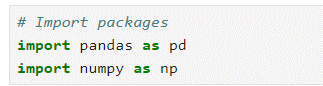

Then, loading the dataset into a dataframe. Creating a dataframe will help me conduct data manipulation, exploratory data analysis (EDA), and statistical activities.

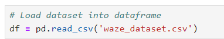

**Understanding the data - Inspecting the data**

Now, I will view and inspect summary information about the dataframe.

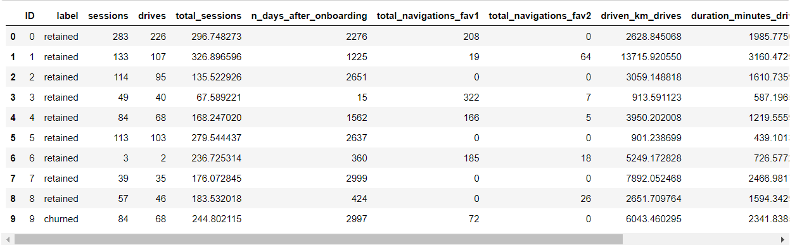

None of the variables in the first 10 observations have missing values. Note that this does not imply the whole dataset does not have any missing values.

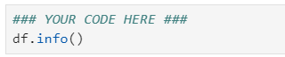

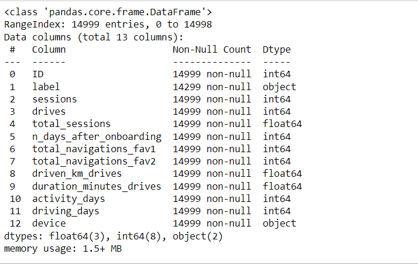

The variables 'label' and 'device' are of type object; 'total_sessions', 'driven_km_drives', and 'duration_minutes_drives' are of type float64; the rest of the variables are of type int64. There are 14,999 rows and 13 columns. The dataset has 700 missing values in the label column.

To compare the summary statistics of the 700 rows that are missing labels with summary statistics of the rows that are not missing any values:

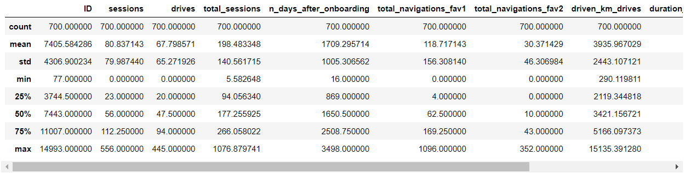

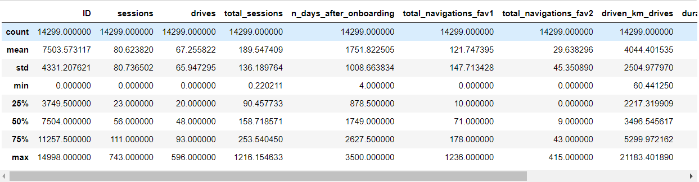

Comparing summary statistics of the observations with missing retention labels with those that aren't missing any values reveals nothing remarkable. The means and standard deviations are fairly consistent between the two groups.

**Understanding the data - Investigating the variables**

In this phase, I will begin to investigate the variables more closely to better understand them.

I will start by checking the two populations with respect to the 'device' variable to find how many iPhone users had null values and how many Android users had null values?

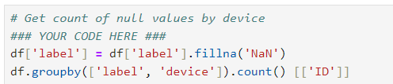

Of the 700 rows with null values, 447 were iPhone users and 253 were Android users.

Now, of the rows with null values, I will calculate the percentage with each device—Android and iPhone. I will do this directly with the value_counts() function.

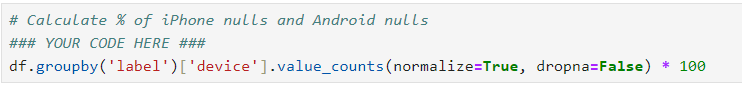

To check how this compares to the device ratio in the full dataset:

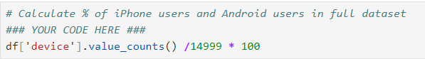

The percentage of missing values by each device is consistent with their representation in the data overall. There is nothing to suggest a non-random cause of the missing data.

Next, I will examine the counts and percentages of users who churned vs. those who were retained to find how many of each group are represented in the data.

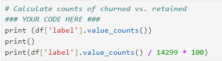

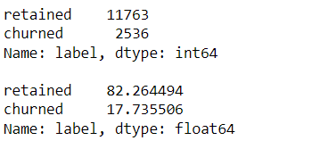

This dataset contains 82% retained users and 18% churned users.

Next, I will compare the medians of each variable for churned and retained users. The reason for calculating the median and not the mean is that I don't want outliers to unduly affect the portrayal of a typical user. For example, in the driven_km_drives column, the maximum value is 21,183 km. That's more than half the circumference of the earth!

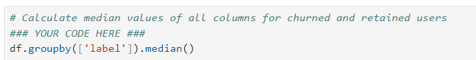

This offers an interesting snapshot of the two groups, churned vs. retained:
- Users who churned averaged ~3 more drives in the last month than retained users, but retained users used the app on over twice as many days as churned users in the same time period.
- The median churned user drove ~200 more kilometers and 2.5 more hours during the last month than the median retained user.

It seems that churned users had more drives in fewer days, and their trips were farther and longer in duration. This might be suggestive of a user profile. I will continue exploring to find out.

Next, I will calculate the median kilometers per drive in the last month for both retained and churned users. I will begin by dividing the driven_km_drives column by the drives column. Then, group the results by churned/retained and calculate the median km/drive of each group:

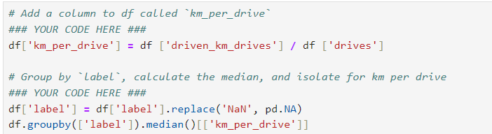

The median retained user drove about one more kilometer per drive than the median churned user. To find out how many kilometers per driving day this was, I will repeat the steps above using driving_days instead of drives:

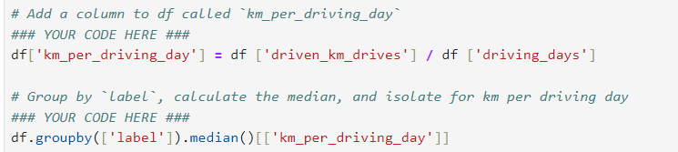

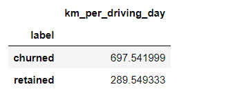

Next, I'll calculate the median number of drives per driving day for each group.

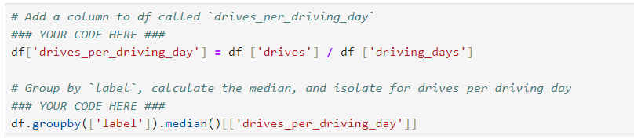

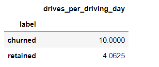

The median user who churned drove 698 kilometers each day they drove last month, which is ~240% the per-drive-day distance of retained users. The median churned user had a similarly disproporionate number of drives per drive day compared to retained users.

It is clear from these figures that, regardless of whether a user churned or not, the users represented in this data are serious drivers! It would probably be safe to assume that this data does not represent typical drivers at large. Perhaps the data—and in particular the sample of churned users—contains a high proportion of long-haul truckers.

In consideration of how much these users drive, it would be worthwhile to recommend to Waze that they gather more data on these super-drivers. It's possible that the reason for their driving so much is also the reason why the Waze app does not meet their specific set of needs, which may differ from the needs of a more typical driver, such as a commuter.

Finally, I'll examine whether there is an imbalance in how many users churned by device type. I'll start this by getting the overall counts of each device type for each group, churned and retained.

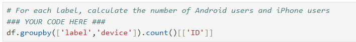

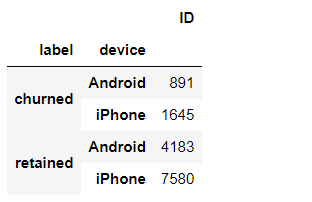

Now, within each group, churned and retained, I'm going to calculate what percent was Android and what percent was iPhone:

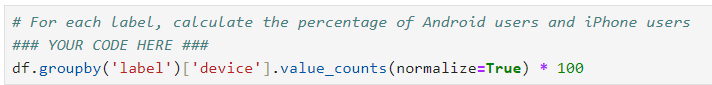

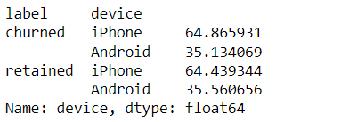

The ratio of iPhone users and Android users is consistent between the churned group and the retained group, and those ratios are both consistent with the ratio found in the overall dataset.

My supervisor, May Santner (Data Analysis Manager), has requested that I share my findings with the data team in an executive summary. As I prepare to write this summary, I will consider key points relevant to the user churn project and determine what information is most important to share with the team. You can access the executive summary through the following link:

[Link to Waze Executive Summary](Waze_Executive_Summary.pdf)

## **Step 3 - Exploratory Data Analysis and Data Visualisation**

So far, I have completed a project proposal, and used Python to inspect and organize Waze’s user data. Now, the data is ready for exploratory data analysis (EDA) and further data visualization.  I'll be conducting EDA for the user churn project. I'll use Python's matplotlib and seaborn libraries to help identify outliers. To create a more polished presentation, I'll use Tableau to design visuals for an executive summary that will help non-technical stakeholders engage with and understand the data. Additionally, I will provide an executive summary of my analysis for the broader data team.

### **Imports and data loading**

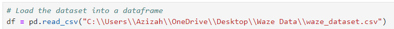

### **Data exploration and cleaning**

I will apply the following methods and attributes on the dataframe: head(), size, describe(), and info() to obtain an overview of the data and its summary statistics.

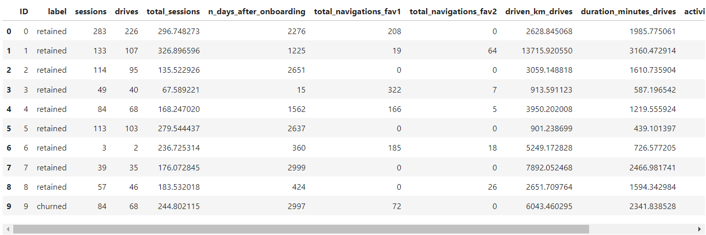

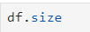

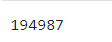

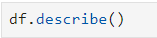

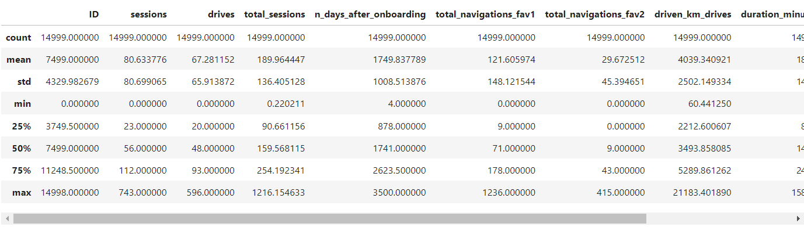

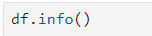

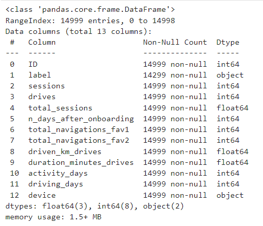

### **Visualisations**

Next, I will proceed to visualise the distribution of the data. Box plots will be helpful in determining outliers and where the bulk of the data points reside in terms of 'drives', 'sessions' and all other continuous numeric variables. Histograms are essential to understanding the distribution of variables. Scatter plots will be helpful to visualise relationships between variables. Bar charts are useful for communicating levels and quantities, especially for categorical information.

I will begin by examining the spread and distribution of important variables using box plots and histograms.

**"sessions"**

The number of occurrences of a user opening the app during the month.

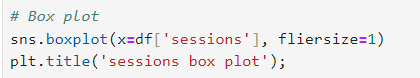

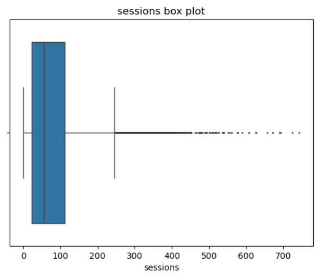

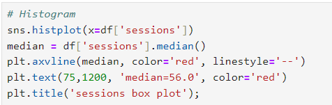

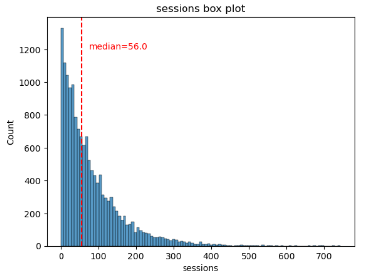

The sessions variable is a right-skewed distribution with half of the observations having 56 or fewer sessions. However, as indicated by the boxplot, some users have more than 700.

**"drives"**

An occurrence of driving at least 1 km during the month

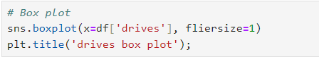

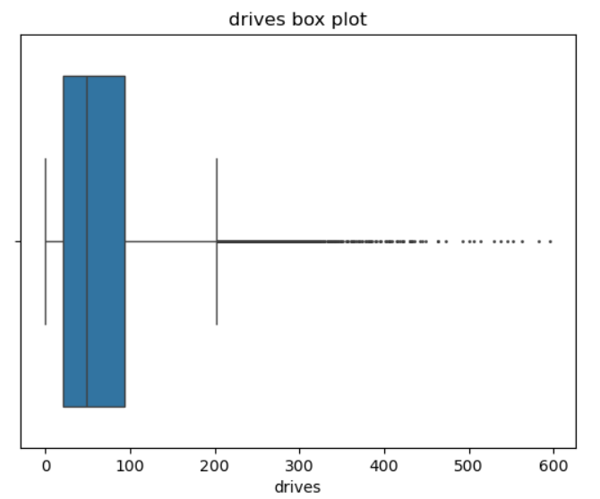

During this EDA, several tasks, like plotting histograms for various variables, are frequently repeated. To streamline the process and avoid redundant code, I’ve created a function that improves efficiency.

The following code block defines a function to plot histograms in a consistent style and format.

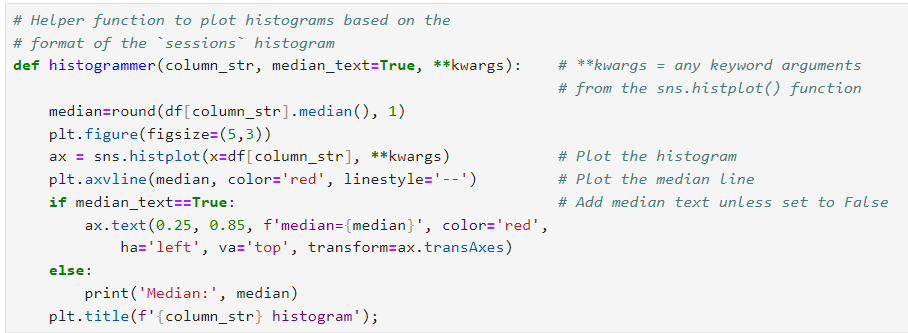

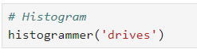

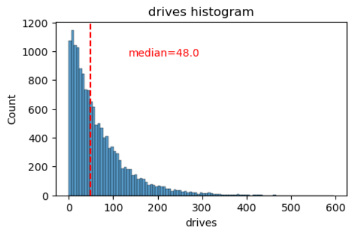

The "drives" information follows a distribution similar to the "sessions" variable. It is right-skewed, approximately log-normal, with a median of 48. However, some drivers had over 400 drives in the last month.

"total_sessions"

A model estimate of the total number of sessions since a user has onboarded.

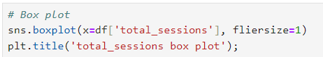

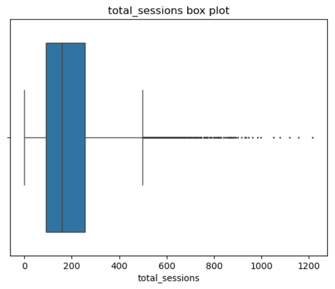

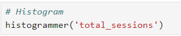

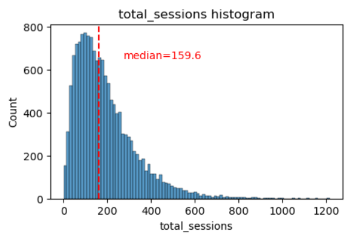

The "total_sessions" is a right-skewed distribution. The median total number of sessions is 159.6. This is interesting information because, if the median number of sessions in the last month was 56 and the median total sessions was ~160, then it seems that a large proportion of a user's (estimated) total drives might have taken place in the last month. 

"n_days_after_onboarding"

The number of days since a user signed up for the app

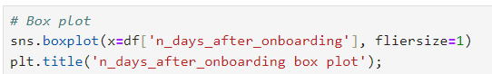

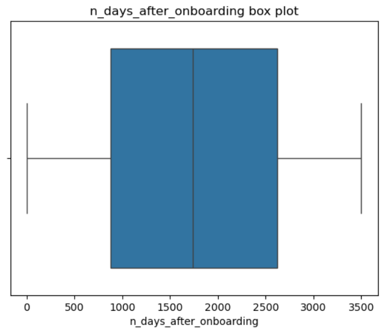

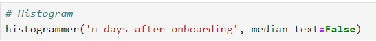

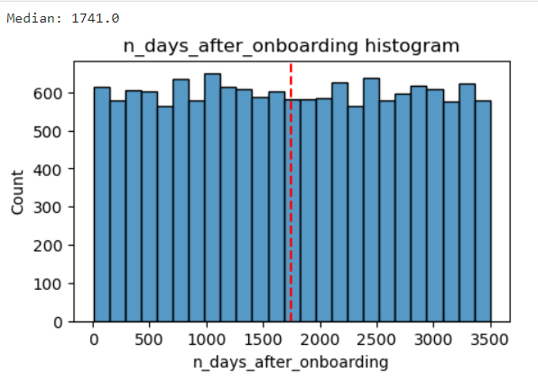

The total user tenure (i.e., number of days since onboarding) is a uniform distribution with values ranging from near-zero to ~3,500 (~9.5 years).

"driven_km_drives"

Total kilometers driven during the month

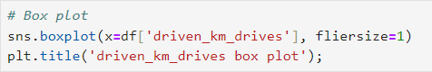

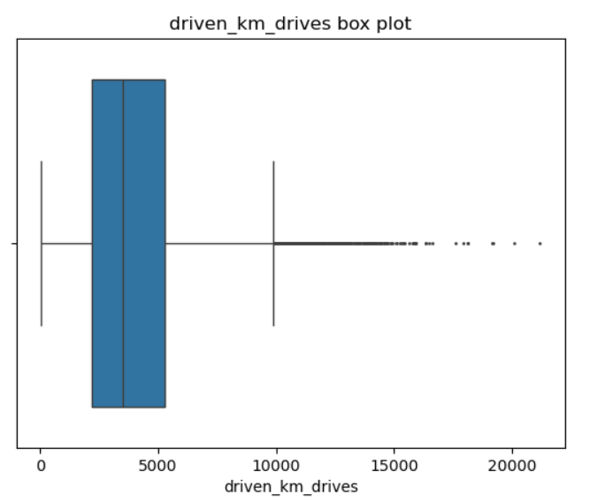

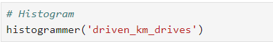

The number of drives driven in the last month per user is a right-skewed distribution with half the users driving under 3,495 kilometers. As you discovered in the analysis from the previous course, the users in this dataset drive a lot. The longest distance driven in the month was over half the circumferene of the earth.

"duration_minutes_drives"

Total duration driven in minutes during the month

The "duration_minutes_drive" variable has a heavily skewed right tail. Half of the users drove less than ~1,478 minutes (~25 hours), but some users clocked over 250 hours over the month.

"activity_days"

Number of days the user opens the app during the month.

Within the last month, users opened the app a median of 16 times. The box plot reveals a centered distribution. The histogram shows a nearly uniform distribution of ~500 people opening the app on each count of days. However, there are ~250 people who didn't open the app at all and ~250 people who opened the app every day of the month.

This distribution is noteworthy because it does not mirror the sessions distribution, which one might think would be closely correlated with "activity_days".

