# Waze Project

## Waze Churn Prediction Model Project

 
**Note**: _This project is created in partnership between Google Advanced Data Analytics Professional Certificate and the real-time driving directions app, Waze. The story, all names, characters, and incidents portrayed in this project are fictitious. No identification with actual persons (living or deceased) is intended or should be inferred. And the data shared in this project has been created for pedagogical purposes._

## **Project Background**

Waze’s free navigation app makes it easier for drivers around the world to get to where they want to go. Waze’s community of map editors, beta testers, translators, partners, and users helps make each drive better and safer. Waze partners with cities, transportation authorities, broadcasters, businesses, and first responders to help as many people as possible travel more efficiently and safely.
Waze are about to start a new project to help prevent user churn on the Waze app. Churn quantifies the number of users who have uninstalled the Waze app or stopped using the app. This project focuses on monthly user churn. 
This project is part of a larger effort at Waze to increase growth. Typically, high retention rates indicate satisfied users who repeatedly use the Waze app over time. Developing a churn prediction model will help prevent churn, improve user retention, and grow Waze’s business. An accurate model can also help identify specific factors that contribute to churn and answer questions such as: 
-	Who are the users most likely to churn?
-	Why do users churn? 
-	When do users churn?
  
## **Scenario**
## **Step 1 - Project Proposal**
As a data analyst, I will collaborate with my Waze teammates to analyse and interpret data, generate valuable insights, and help leadership make informed business decisions. In my role, I will analyse user data and develop a machine learning model that predicts user churn. 
The insights that the team and I generate will help Waze leadership optimise the company’s retention strategy, enhance user experience, and make data-driven decisions about product development.
For my first assignment, I will be creating a project proposal that will create milestones for the tasks within this project.

**Team members at Waze**

As a new data analyst, I’ll work closely with a talented team of experienced data professionals. I’ll also collaborate with Waze co-workers outside the data team as the project requires. 

**Data team roles**
-	Harriet Hadzic - Director of Data Analysis 
-	May Santner - Data Analysis Manager 
-	Chidi Ga - Senior Data Analyst 
-	Sylvester Esperanza - Senior Project Manager 

**Other roles**
-	Emrick Larson - Finance and Administration Department Head 
-	Ursula Sayo - Operations Manager 

**Workflow Structure**

I will be using the PACE workflow framework throughout this project in order to provide a clear foundation and structure for this data analysis project. PACE is an acronym and each one of the letters represents an actionable stage in a project: plan, analyse, construct, and execute.

 
**Plan Stage**: First, I need to ask and answer some relevant questions for this project. These include:
-	Who is my audience for this project? My audience for this project includes my data team members, as well as the other team members I would be working with.
-	What am I trying to solve or accomplish? And what do I anticipate the impact of this work will be on the larger needs of the client? In this project, we aim to develop a machine learning model to predict user churn on the Waze app by analysing user data and identifying key factors that lead to churn. The impact will be improved user retention, enhanced user experience, and increased business growth through data-driven decision-making and targeted interventions. This will help Waze maintain a competitive edge and support long-term business success.
-	What questions need to be asked or answered? These include:
    -	What are the specific goals and objectives of the churn prediction project?
    -	What is the condition of the provided dataset?
    -	What variables will be the most useful?
    -	Are there trends within the data that can provide insight?
    -	What steps can I take to reduce the impact of bias?
    -	Are there any data quality issues or gaps that need to be addressed?
    -	How will data from different sources be integrated and preprocessed?
    -	What data governance and privacy considerations need to be taken into account?
    -	What machine learning algorithms will be used to develop the churn prediction model?
    -	What metrics will be used to evaluate the model's performance?
    -	What techniques will be used to validate the model's accuracy and reliability?
    -	What are the key factors contributing to user churn?
    -	Who are the users most likely to churn?
    -	What strategies can be implemented to prevent churn and improve user retention?
    -	What type of reports and visualisations will be created to communicate findings?
    -	How will we tailor communication for different stakeholders, including technical and non-technical audiences?
    -	What are the main talking points for the presentation to the leadership team?

-	What resources are required to complete this project?
    - Team members
    - Input from stakeholders
    - Budget/Funding
    - Project Dataset
    - A statistical tool – e.g., Python (Python notebook)

-	What are the deliverables that will need to be created over the course of this project?
  
    - A project proposal
    - Prepared and cleaned datasets
    - Statistical model
    - Regression analysis model
    - Machine learning model
    - Exploratory Data Analysis reports
    - Stakeholder reports
    - Visualizations e.g. dashboard

[Link to Waze Project Proposal](assets/Waze_project_proposal.pdf)

## **Step 2 - Data Cleaning and Organisation**
I have received notice that the project proposal submitted by the team has been approved and we have been given access to Waze’s user data. To get clear insights, the data must be inspected, organised, and prepared to begin the process of exploratory data analysis (EDA). I will be using Python programming language for this step and all my codes will be written and executed in a Jupyter Notebook. The goal is for me to construct a dataframe in Python, perform a cursory inspection of the provided dataset, and inform the Waze data team members of my findings. I will split this into 3 parts:

Part 1: This involves me trying to understand the situation – I will begin by exploring the dataset and reviewing the Data Dictionary.

Part 2: This involves me trying to understand the data. Here I will:
- create a pandas dataframe for data learning, future exploratory data analysis (EDA), and statistical activities.
- compile summary information about the data to inform next steps.

Part 3: This involves me trying to understand the variables. Here I will:
- use insights from my examination of the summary data to guide deeper investigation into variables.

**Imports and data loading**

I’m starting by importing the packages that I will need.

Then, loading the dataset into a dataframe. Creating a dataframe will help me conduct data manipulation, exploratory data analysis (EDA), and statistical activities.

**Understanding the data - Inspecting the data**

Now, I will view and inspect summary information about the dataframe.

None of the variables in the first 10 observations have missing values. Note that this does not imply the whole dataset does not have any missing values.

The variables 'label' and 'device' are of type object; 'total_sessions', 'driven_km_drives', and 'duration_minutes_drives' are of type float64; the rest of the variables are of type int64. There are 14,999 rows and 13 columns. The dataset has 700 missing values in the label column.

To compare the summary statistics of the 700 rows that are missing labels with summary statistics of the rows that are not missing any values:

Comparing summary statistics of the observations with missing retention labels with those that aren't missing any values reveals nothing remarkable. The means and standard deviations are fairly consistent between the two groups.

**Understanding the data - Investigating the variables**

In this phase, I will begin to investigate the variables more closely to better understand them.

I will start by checking the two populations with respect to the 'device' variable to find how many iPhone users had null values and how many Android users had null values?

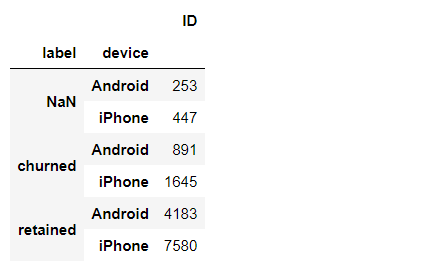

Of the 700 rows with null values, 447 were iPhone users and 253 were Android users.

Now, of the rows with null values, I will calculate the percentage with each device—Android and iPhone. I will do this directly with the value_counts() function.

To check how this compares to the device ratio in the full dataset:

The percentage of missing values by each device is consistent with their representation in the data overall. There is nothing to suggest a non-random cause of the missing data.

Next, I will examine the counts and percentages of users who churned vs. those who were retained to find how many of each group are represented in the data.

This dataset contains 82% retained users and 18% churned users.

Next, I will compare the medians of each variable for churned and retained users. The reason for calculating the median and not the mean is that I don't want outliers to unduly affect the portrayal of a typical user. For example, in the driven_km_drives column, the maximum value is 21,183 km. That's more than half the circumference of the earth!

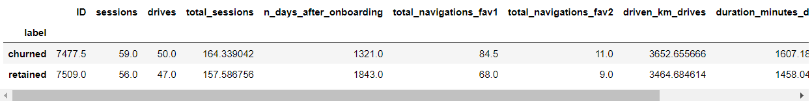

This offers an interesting snapshot of the two groups, churned vs. retained:
- Users who churned averaged ~3 more drives in the last month than retained users, but retained users used the app on over twice as many days as churned users in the same time period.
- The median churned user drove ~200 more kilometers and 2.5 more hours during the last month than the median retained user.

It seems that churned users had more drives in fewer days, and their trips were farther and longer in duration. This might be suggestive of a user profile. I will continue exploring to find out.

Next, I will calculate the median kilometers per drive in the last month for both retained and churned users. I will begin by dividing the driven_km_drives column by the drives column. Then, group the results by churned/retained and calculate the median km/drive of each group:

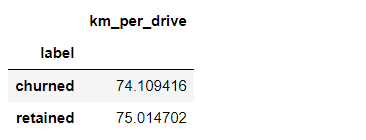

The median retained user drove about one more kilometer per drive than the median churned user. To find out how many kilometers per driving day this was, I will repeat the steps above using driving_days instead of drives:

Next, I'll calculate the median number of drives per driving day for each group.

The median user who churned drove 698 kilometers each day they drove last month, which is ~240% the per-drive-day distance of retained users. The median churned user had a similarly disproporionate number of drives per drive day compared to retained users.

It is clear from these figures that, regardless of whether a user churned or not, the users represented in this data are serious drivers! It would probably be safe to assume that this data does not represent typical drivers at large. Perhaps the data—and in particular the sample of churned users—contains a high proportion of long-haul truckers.

In consideration of how much these users drive, it would be worthwhile to recommend to Waze that they gather more data on these super-drivers. It's possible that the reason for their driving so much is also the reason why the Waze app does not meet their specific set of needs, which may differ from the needs of a more typical driver, such as a commuter.

Finally, I'll examine whether there is an imbalance in how many users churned by device type. I'll start this by getting the overall counts of each device type for each group, churned and retained.

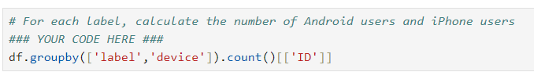

Now, within each group, churned and retained, I'm going to calculate what percent was Android and what percent was iPhone:

The ratio of iPhone users and Android users is consistent between the churned group and the retained group, and those ratios are both consistent with the ratio found in the overall dataset.

My supervisor, May Santner (Data Analysis Manager), has requested that I share my findings with the data team in an executive summary. As I prepare to write this summary, I will consider key points relevant to the user churn project and determine what information is most important to share with the team. You can access the executive summary through the following link:

[Link to Waze Executive Summary](Waze_Executive_Summary.pdf)

## **Step 3 - Exploratory Data Analysis and Data Visualisation**

So far, I have completed a project proposal, and used Python to inspect and organize Waze’s user data. Now, the data is ready for exploratory data analysis (EDA) and further data visualization.  I'll be conducting EDA for the user churn project. I'll use Python's matplotlib and seaborn libraries to help identify outliers. To create a more polished presentation, I'll use Tableau to design visuals for an executive summary that will help non-technical stakeholders engage with and understand the data. Additionally, I will provide an executive summary of my analysis for the broader data team.

### **Imports and data loading**

### **Data exploration and cleaning**

I will apply the following methods and attributes on the dataframe: head(), size, describe(), and info() to obtain an overview of the data and its summary statistics.

### **Visualisations**

Next, I will proceed to visualise the distribution of the data. Box plots will be helpful in determining outliers and where the bulk of the data points reside in terms of 'drives', 'sessions' and all other continuous numeric variables. Histograms are essential to understanding the distribution of variables. Scatter plots will be helpful to visualise relationships between variables. Bar charts are useful for communicating levels and quantities, especially for categorical information.

I will begin by examining the spread and distribution of important variables using box plots and histograms.

**"sessions"**

The number of occurrences of a user opening the app during the month.

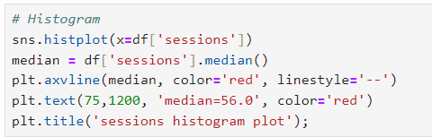

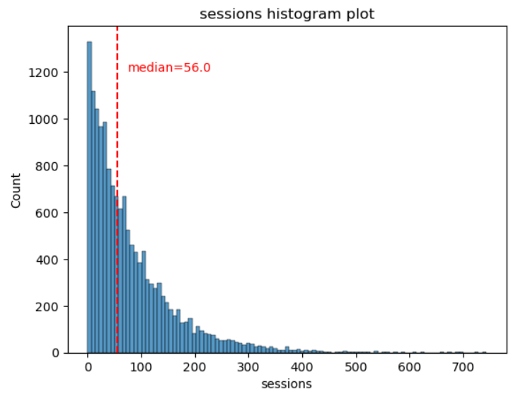

The sessions variable is a right-skewed distribution with half of the observations having 56 or fewer sessions. However, as indicated by the boxplot, some users have more than 700.

**"drives"**

An occurrence of driving at least 1 km during the month

During this EDA, several tasks, like plotting histograms for various variables, are frequently repeated. To streamline the process and avoid redundant code, I’ve created a function that improves efficiency.

The following code block defines a function to plot histograms in a consistent style and format.

The "drives" information follows a distribution similar to the "sessions" variable. It is right-skewed, approximately log-normal, with a median of 48. However, some drivers had over 400 drives in the last month.

**"total_sessions"**

A model estimate of the total number of sessions since a user has onboarded.

The "total_sessions" is a right-skewed distribution. The median total number of sessions is 159.6. This is interesting information because, if the median number of sessions in the last month was 56 and the median total sessions was ~160, then it seems that a large proportion of a user's (estimated) total drives might have taken place in the last month. 

**"n_days_after_onboarding"**

The number of days since a user signed up for the app

The total user tenure (i.e., number of days since onboarding) is a uniform distribution with values ranging from near-zero to ~3,500 (~9.5 years).

**"driven_km_drives"**

Total kilometers driven during the month

The number of drives driven in the last month per user is a right-skewed distribution with half the users driving under 3,495 kilometers. As you discovered in the analysis from the previous course, the users in this dataset drive a lot. The longest distance driven in the month was over half the circumferene of the earth.

**"duration_minutes_drives"**

Total duration driven in minutes during the month

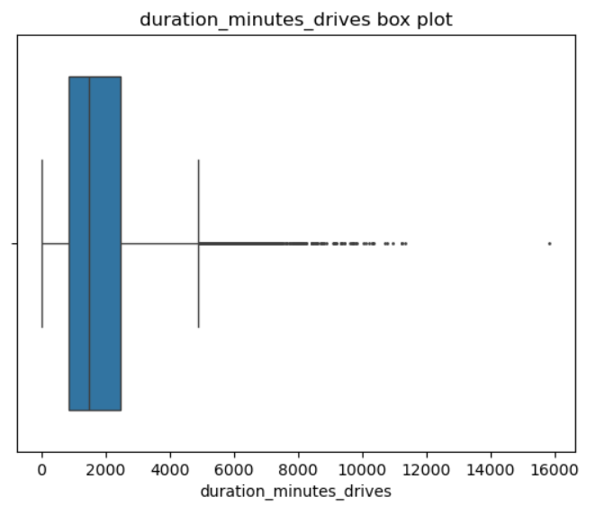

The "duration_minutes_drive" variable has a heavily skewed right tail. Half of the users drove less than ~1,478 minutes (~25 hours), but some users clocked over 250 hours over the month.

**"activity_days"**

Number of days the user opens the app during the month.

Within the last month, users opened the app a median of 16 times. The box plot reveals a centered distribution. The histogram shows a nearly uniform distribution of ~500 people opening the app on each count of days. However, there are ~250 people who didn't open the app at all and ~250 people who opened the app every day of the month.

This distribution is noteworthy because it does not mirror the sessions distribution, which one might think would be closely correlated with "activity_days".

**"driving_days"**

Number of days the user drives (at least 1 km) during the month.

The number of days users drove each month is almost uniform, and it largely correlates with the number of days they opened the app that month, except the "driving_days" distribution tails off on the right.

However, there were almost twice as many users (~1,000 vs. ~550) who did not drive at all during the month. This might seem counterintuitive when considered together with the information from "activity_days". That variable had ~500 users opening the app on each of most of the day counts, but there were only ~250 users who did not open the app at all during the month and ~250 users who opened the app every day.

**"device"**

The type of device a user starts a session with.

Since this is a categorical variable, a box plot is not suitable. Instead, a pie chart is a better choice for visualizing a binary categorical variable.

There are nearly twice as many iPhone users as Android users represented in this data.

**"label"**

Binary target variable (“retained” vs “churned”) for if a user has churned anytime during the course of the month.

This is also a categorical variable, and as such would not be plotted as a box plot. I'll plot a pie chart instead.

Less than 18% of the users churned.

**"driving_days vs. activity_days"**

Because both "driving_days" and "activity_days" represent counts of days over a month and they're also closely related, i'll plot them together on a single histogram. This will help to better understand how they relate to each other without having to scroll back and forth comparing histograms in two different places.

I'll plot a histogram that, for each day, has a bar representing the counts of driving_days and user_days.

As observed previously, this might seem counterintuitive. After all, why are there fewer people who didn't use the app at all during the month and more people who didn't drive at all during the month?

On the other hand, it could just be illustrative of the fact that, while these variables are related to each other, they're not the same. People probably just open the app more than they use the app to drive—perhaps to check drive times or route information, to update settings, or even just by mistake.

Also, it seems that the number of days in the month is not the same between variables.

To confirm the maximum number of days for each variable — "driving_days" and "activity_days":

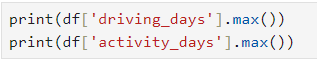

It's true. Although it's possible that not a single user drove all 31 days of the month, it's highly unlikely, considering there are 15,000 people represented in the dataset.

One other way to check the validity of these variables is to plot a simple scatter plot with the x-axis representing one variable and the y-axis representing the other.

Notice that there is a theoretical limit. If a driver uses the app to drive, then by definition it must count as a day-use as well. In other words, a driver cannot have more drive-days than activity-days. None of the samples in this data violate this rule, which is good.

**"Retention by device"**

I will plot a histogram that has four bars — one for each device-label-combination to show how many iPhone users were retained/churned and how many Android users were retained/churned.

The proportion of churned users to retained users is consistent between device types.

**Retention by kilometres driven per driving day**

During the cleaning and organisation step, I found that the median distance driven per driving day last month was 608.78 km for users who churned, compared to 247.48 km for those who did not churn. This warrants further investigation.

I will now create a new column in the dataframe, df called "km_per_driving_day," representing the mean distance driven per driving day for each user. Afterward, I will use the describe() method to summarise the statistics for this new column.

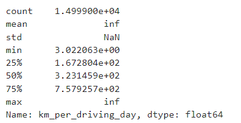

The mean value is infinity, the standard deviation is NaN, and the max value is infinity. This is the result of there being values of zero in the "driving_days"  column. Pandas imputes a value of infinity in the corresponding rows of the new column because division by zero is undefined. I will convert these values from infinity to zero using np.inf to refer to a value of infinity. Then, I'll call describe() on the new "km_per_driving_day" column to verify that it worked:

The maximum value is 15,420 kilometers per drive day. This is physically impossible. Driving 100 km/hour for 12 hours is 1,200 km. It's unlikely many people averaged more than this each day they drove, so, for now, I will disregard rows where the distance in this column is greater than 1,200 km.

I will plot a histogram of the new km_per_driving_day column, disregarding those users with values greater than 1,200 km. Each bar would be the same length and have two colors, one color representing the percent of the users in that bar that churned and the other representing the percent that were retained.

The churn rate tends to increase as the mean daily distance driven increases, confirming what was found previously.

**Churn rate per number of driving days**

I will create another histogram just like the previous one, only this time it would represent the churn rate for each number of driving days.

The churn rate is highest for people who didn't use Waze much during the last month. The more times they used the app, the less likely they were to churn. While 40% of the users who didn't use the app at all last month churned, nobody who used the app for 30 days churned.

This isn't surprising. If people who used the app a lot churned, it would likely indicate dissatisfaction. When people who don't use the app churn, it might be the result of dissatisfaction in the past, or it might be indicative of a lesser need for a navigational app. Maybe they moved to a city with good public transportation and don't need to drive anymore.

**Proportion of sessions that occurred in the last month**

I will create a new column called "percent_sessions_in_last_month" that represents the percentage of each user's total sessions that were logged in their last month of use.

Now, I'll create a histogram depicting the distribution of values in this new column:

Now, I'll check the median value of the "n_days_after_onboarding" variable.

Half of the people in the dataset had 40% or more of their sessions in just the last month, yet the overall median time since onboarding is almost five years.

I'll make a histogram of "n_days_after_onboarding" for just the people who had 40% or more of their total sessions in the last month.

The number of days since onboarding for users with 40% or more of their total sessions occurring in just the last month is a uniform distribution. This is very strange.

### **Handling outliers**

The box plots above indicate that many of the variables have outliers. These outliers do not seem to be data entry errors; they are present because of the right-skewed distributions.

I will be imputing outlying data with more reasonable values. I will perform this imputation by setting a threshold based on a percentile of the distribution.

I will write a function that calculates the 95th percentile of a given column, then imputes values > the 95th percentile with the value at the 95th percentile such as the 95th percentile of the distribution.

Next, I'll apply that function to the following columns: "sessions", "drives", "total_sessions", "driven_km_drives", "duration_minutes_drives".

I'll apply the describe() method to confirm if my change worked.

Analysis revealed that the overall churn rate is ~17%, and that this rate is consistent between iPhone users and Android users. Also, EDA has revealed that users who drive very long distances on their driving days are more likely to churn, but users who drive more often are less likely to churn.

Things I have learned from this EDA are:

- There is missing data in the user churn label, so I might need further data processing before further analysis.
- There are many outlying observations for drives, so I might have to consider a variable transformation to stabilise the variation.
- The number of drives and the number of sessions are both strongly correlated, so they might provide redundant information when I incorporate both in a model.
- On average, retained users have fewer drives than churned users.

Having completed the exploration and visualization of the data, the next step is to present my findings to Harriet Hadzic, Waze's Director of Data Analysis. Below is a link to the executive summary I have prepared for the leadership team.

[Link to Waze Executive Summary](Waze_Executive_Summary_2.pdf)

## **Step 4 - Data Exploration and Hypothesis Testing**

We are now approaching the midpoint of the user churn project. So far, I’ve completed the project proposal and used Python to explore and analyse Waze’s user data. Additionally, I have used Python to create data visualisations. The next step is to apply statistical methods to analyse and interpret the data.

I’ve received an email from Sylvester Esperanza, the project manager, informing the team of a new request from leadership: to analyse the relationship between the average number of rides and device type. I've also discovered follow-up emails from three other team members—May Santner, Chidi Ga, and Harriet Hadzic—discussing the details of the analysis. They are requesting a statistical analysis of ride data based on device type. Specifically, leadership is interested in whether there is a statistically significant difference in the average number of rides between iPhone® users and Android™ users. A final email from Chidi outlines my specific task: to perform a two-sample hypothesis test (t-test) to analyse the difference in the average number of rides between iPhone and Android users.

I will divide my task into 3 parts to help guide me:

**Part 1: Imports, Data Loading and Data Exploration**

- What data packages will be necessary for hypothesis testing?

**Part 2: Conduct Hypothesis Testing**

- How did computing descriptive statistics help me analyse the data?
- How did I formulate my null hypothesis and alternative hypothesis?

**Part 3: Communicate Insights with Stakeholders**

- What key business insight(s) emerged from the hypothesis test?
- What business recommendations do I propose based on thes results?

### **Part 1: Imports, Data Loading and Data Exploration**

I will now import packages and libraries needed to compute descriptive statistics and conduct a hypothesis test.

Then import the dataset.

Then, I'll use Use descriptive statistics to conduct exploratory eata analysis (EDA).

Note: In the dataset, "device" is a categorical variable with the labels "iPhone" and "Android".

In order to perform this analysis, I'll turn each label into an integer. The following code assigns a 1 for an iPhone user and a 2 for Android. It assigns this label back to the variable device_type.

Note: Creating a new variable "device_type" is ideal so that I don't overwrite original data.

I will perform the analysis by:

- Creating a dictionary called "map_dictionary" that contains the class labels ("Android" and "iPhone") for keys and the values I want to convert them to (2 and 1) as values.
- Creating a new column called "device_type" that is a copy of the device column.
- Using the map() method on the "device_type" series. Then, passing "map_dictionary" as its argument, and then reassigning the result back to the "device_type" series.

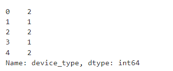

Since I am interested in the relationship between device type and the number of drives, one approach is to examine the average number of drives for each device type. I will calculate these averages accordingly.

Based on the averages shown, it appears that drivers who use an iPhone device to interact with the application have a higher number of drives on average. However, this difference might arise from random sampling, rather than being a true difference in the number of drives. To assess whether the difference is statistically significant, yI will move on to conducting a hypothesis test.

### **Part 2: Conduct Hypothesis Testing**

My goal is to conduct a two-sample t-test, as instructed by Chidi. To do this, I follow the steps for conducting a hypothesis test:

- State the null hypothesis and the alternative hypothesis
- Choose a signficance level
- Find the p-value
- Reject or fail to reject the null hypothesis

**State the null hypothesis and the alternative hypothesis**

Hypotheses:

- **Null Hypothesis (H0)**: There is no difference in average number of drives between drivers who use iPhone devices and drivers who use Androids.
- **Alternative Hypothesis (HA)**: There is a difference in average number of drives between drivers who use iPhone devices and drivers who use Androids.

**Choose a signficance level**

I'm choosing 5% as the significance level.

**Find the p-value**

**Reject or fail to reject the null hypothesis**

Since the p-value is larger than the chosen significance level (5%), I'll _**fail to reject**_ the null hypothesis. My conclusion is that there is not a statistically significant difference in the average number of drives between drivers who use iPhones and drivers who use Androids.

### **Part 3: Communicate Insights with Stakeholders**

Now that I've completed the hypothesis test, the next step is to share my findings with the Waze leadership team.

The key business insight is that drivers who use iPhone devices on average have a similar number of drives as those who use Androids.

One potential next step is to explore what other factors influence the variation in the number of drives, and run additonal hypothesis tests to learn more about user behavior. Further, temporary changes in marketing or user interface for the Waze app may provide more data to investigate churn.

I have created an executive summary for the leadership team. Below is a link to the executive summary I have prepared for the leadership team.

[Link to Waze Executive Summary](Waze_Executive_Summary_4.pdf)

## **Step 5 - Regression Modelling**

I am now over halfway through the project to develop a machine learning model for predicting user churn. Leadership has requested that the team build a regression model to predict churn based on various factors.

I plan to implement a binomial logistic regression model. Since the goal is to predict user churn, this model will help guide the best approach for the machine learning algorithm in the final phase of the project.

I will move forward by breaking this phase into specific tasks, such as:

- Task 1: Imports and Data Loading
- Task 2a: Explore Data with EDA
- Task 2b: Create Features
- Task 3a: Preparing Variables
- Task 3b: Determine Whether Assumptions Have Been Met
- Task 3c: Create Dummies
- Task 3d: Model Building
- Task 4a: Results and Evaluation
- Task 4b: Show Results with a Confusion Matrix
- Task 4c: Conclusion

### **Task 1: Imports and Data Loading**

I will import the data and packages that are needed for building logistic regression models.

Then, import the dataset.

### **Task 2a: Explore Data with EDA**

I will analyse and discover data, looking for correlations, missing data, potential outliers, and/or duplicates.

Starting with shape and info().

The _"label"_ column is missing 700 values.

Then, moving on to viewing the top 5 rows of the dataset.

Then, I'll use the drop() method to remove the _"ID"_ column since I don't need this information for my analysis.

Now, I'll check the class balance of the dependent (target) variable, _"label"_.

Then, I'll call describe() on the data.

Just by assessing at the quartile values, standard deviation, and max values, the following columns all seem to have outliers:

- sessions
- drives
- total_sessions
- total_navigations_fav1
- total_navigations_fav2
- driven_km_drives
- duration_minutes_drives

All of these columns have max values that are multiple standard deviations above the 75th percentile. This could indicate outliers in these variables.

### **Task 2b: Create Features**

In this task, I will create features that are needed to address the business problem.

I know from earlier EDA that churn rate correlates with distance driven per driving day in the last month. Therefore, I think it might be helpful to engineer a feature that captures this information.

I will create a new column in df called _"km_per_driving_day"_, which represents the mean distance driven per driving day for each user. Then, I'll call the describe() method on the new column.

Note that some values are infinite. This is the result of there being values of zero in the _"driving_days"_ column. Pandas imputes a value of infinity in the corresponding rows of the new column because division by zero is undefined.

Now, I'll convert these values from infinity to zero. I'll use np.inf to refer to a value of infinity. Then, I'll call describe() on the _"km_per_driving_day"_ column to verify that it worked.

Next, I'll create a new binary feature called _"professional_driver"_ that is a 1 for users who had 60 or more drives and drove on 15+ days in the last month.

Note: The objective is to create a new feature that separates professional drivers from other drivers. To create this column, I'll use the np.where() function.

I'll perform a quick inspection of the new variable by checking the count of professional drivers and non-professionals. Also, within each class (professional and non-professional), I'll calculate the churn rate.

The churn rate for professional drivers is 7.6%, while the churn rate for non-professionals is 19.9%. This seems like it could add predictive signal to the model.

### **Task 3a: Preparing Variables**

I'll call info() on the dataframe to check the data type of the _"label"_ variable and to verify if there are any missing values.

Because I know from previous EDA that there is no evidence of a non-random cause of the 700 missing values in the _"label"_ column, and because these observations comprise less than 5% of the data, I'll use the dropna() method to drop the rows that are missing this data.

As noted in task 2a, I identified seven variables that may contain potential outliers. In this analysis, I will address these outliers by imputing the values in the affected columns. For each column, I will calculate the 95th percentile and replace any value that exceeds this threshold with the corresponding percentile value.

Call describe() on the data to confirm it worked.

Now, I will encode categorical variables.

To do this, I will change the data type of the label column to be binary. This change is needed to train a logistic regression model.

I will assign a 0 for all retained users and assign a 1 for all churned users. I'll save the variable as _"label2"_ as to not overwrite the original label variable.

### **Task 3b: Determine whether assumptions have been met**

The following are the assumptions for logistic regression:

- Independent observations (This refers to how the data was collected.
- No extreme outliers.
- Little to no multicollinearity among X predictors.
- Linear relationship between X and the logit of y.

For the first assumption, I have previously discovered that observations are independent for this project.

The second assumption has already been addressed.

The last assumption will be verified after modeling.

For the third assumption, I will check for collinearity as shown below:

I will start by assessing the correlation between the predictor variables by generating a correlation matrix.

Then, I'll plot a correlation heatmap.

Predictor variables that have a Pearson correlation coefficient value greater than the **absolute value of 0.7**, are strongly multicollinear. Therefore, only one of these variables would be used in my model. These variables are:

- _"sessions"_ and _"drives"_: 1.0
- _"driving_days"_ and _"activity_days"_: 0.95

### **Task 3c: Create Dummies**

Since I've chosen _"device"_ as an X variable, I need to convert it into dummy variables since it's a categorical feature. Given that this dataset only has one categorical feature left (device), I don't need to use specialized functions like pandas' pd.get_dummies() or scikit-learn's OneHotEncoder(). Instead, I'll manually implement the transformation. I'll create a new binary column called _"device2"_ to encode user devices as follows:

### **Task 3d: Model building**

First, I'll assign predictor and target variables. 

To build the model, I need to determine which X variables I want to include in the model to predict the target — _"label2"_.
I'll drop the following variables and assign the results to X:
- _"label"_ (this is the target)
- _"label2"_ (this is the target)
- _"device"_ (this is the non-binary-encoded categorical variable)
- _"sessions"_ (this had high multicollinearity)
- _"driving_days"_ (this had high multicollinearity)

**Note:** Notice that I selected _"sessions"_ and _"driving_days"_ to be dropped, rather than _"drives"_ and _"activity_days"_. The reason for this is that the features that I kept for modelling had slightly stronger correlations with the target variable than the features that I dropped.

Now, I'll isolate the dependent (target) variable and assign it to a variable called y.

Next, I'll split the data.

I'll use scikit-learn’s train_test_split() function to perform a train/test split on the data using the X and y variables I assigned above.

**Note 1:** It is important to do a train test to obtain accurate predictions. I'll fit the model on the training set and evaluate the model on the test set to avoid data leakage.
**Note 2:** Because the target class is imbalanced (82% retained vs. 18% churned), I want to make sure that I don’t get an unlucky split that over- or under- represents the frequency of the minority class. I'll set the function’s stratify parameter to y to ensure that the minority class appears in both train and test sets in the same proportion that it does in the overall dataset.

I'll use scikit-learn to instantiate a logistic regression model. I'll also add the argument penalty = 'none' as it is important since the predictors are unscaled. Then I'll Fit the model on X_train and y_train.

I'll use the .coef_ attribute on the model to obtain the coefficients for each variable. These coefficients correspond to the variables in the order they appear in the dataset. To display the results more clearly, I'll create a series where the index consists of the column names, and the values are the coefficients from model.coef_.

Next, I'll call the model's intercept_ attribute to get the intercept of the model.

Next, I'll check final assumption

I'll start by verifying the linear relationship between X and the estimated log odds (known as logits) by making a regplot. I'll call the model's predict_proba() method to generate the probability of response for each sample in the training data. (The training data is the argument to the method.) I'll assign the result to a variable called training_probabilities. This results in a 2-D array where each row represents a user in X_train. The first column is the probability of the user not churning, and the second column is the probability of the user churning.

Now, I'll create a dataframe called _"logit_data"_ that is a copy of _"df"_. Then, I'll create a new column called _"logit"_ in the _"logit_data"_ dataframe. The data in this column should represent the logit for each user.

Now, I'll create a regplot with the x-axis representing an independent variable and the y-axis showing the log-odds of the predicted probabilities. Rather than plotting for every continuous or discrete predictor, I'll focus solely on the variable _"activity_days"_.

### **Task 4a: Results and evaluation**

If the logistic assumptions are met, the model results can be appropriately interpreted.

Now, I'll use the score() method on the model with X_test and y_test as its two arguments to find the accuracy of the model

### **Task 4b: Show results with a confusion matrix**

I'll use the confusion_matrix function to obtain a confusion matrix. I'll use y_test and y_preds as arguments.

Next, I'll use the ConfusionMatrixDisplay() function to display the confusion matrix from the above cell, passing the confusion matrix I just created as its argument.

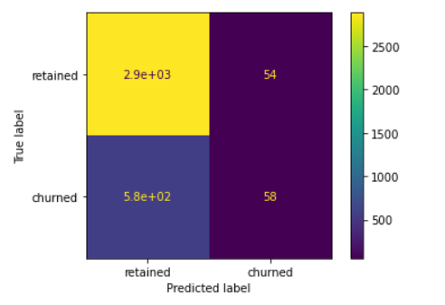

Since I already calculated accuracy, I'll use the confusion matrix to compute precision and recall manually. I'll also use scikit-learn's classification_report() function to generate a table from y_test and y_preds:

**Note:** The model has mediocre precision and very low recall, which means that it makes a lot of false negative predictions and fails to capture users who will churn.

Next, I'll generate a bar graph of the model's coefficients for a visual representation of the importance of the model's features.

### **Task 4c: Conclusion**

Now that I've built the regression model, the next step is to share my findings with the Waze leadership team.

**Questions:**

1. What variable most influenced the model's prediction? How? Was this surprising?
   
- _"activity_days"_ was by far the most important feature in the model. It had a negative correlation with user churn. This was not surprising, as this variable was very strongly correlated with _"driving_days"_, which was known from EDA to have a negative correlation with churn.

2. Were there any variables that I expected to be stronger predictors than they were?
   
- Yes. In previous EDA, user churn rate increased as the values in _"km_per_driving_day"_ increased. The correlation heatmap in this phase revealed this variable to have the strongest positive correlation with churn of any of the predictor variables by a relatively large margin. In the model, it was the second-least-important variable.

3. Why might a variable I thought to be important not be important in the model?
   
- In a multiple logistic regression model, features can interact with each other and these interactions can result in seemingly counterintuitive relationships. This is both a strength and a weakness of predictive models, as capturing these interactions typically makes a model more predictive while at the same time making the model more difficult to explain.

4. Would I recommend that Waze use this model? Why or why not?
   
- It depends. What would the model be used for? If it's used to drive consequential business decisions, then no. The model is not a strong enough predictor, as made clear by its poor recall score. However, if the model is only being used to guide further exploratory efforts, then it can have value.

5. What could I do to improve this model?
   
- New features could be engineered to try to generate better predictive signal, as they often do if one has domain knowledge. In the case of this model, one of the engineered features (professional_driver) was the third-most-predictive predictor. It could also be helpful to scale the predictor variables, and/or to reconstruct the model with different combinations of predictor variables to reduce noise from unpredictive features.

6. What additional features would I like to have to help improve the model?
   
- It would be helpful to have drive-level information for each user (such as drive times, geographic locations, etc.). It would probably also be helpful to have more granular data to know how users interact with the app. For example, how often do they report or confirm road hazard alerts? Finally, it could be helpful to know the monthly count of unique starting and ending locations each driver inputs.

I have also created an executive summary for the leadership team. Below is a link to the executive summary I have prepared for the leadership team.

[Link to Waze Executive Summary](Waze_Executive_Summary_5.pdf)
