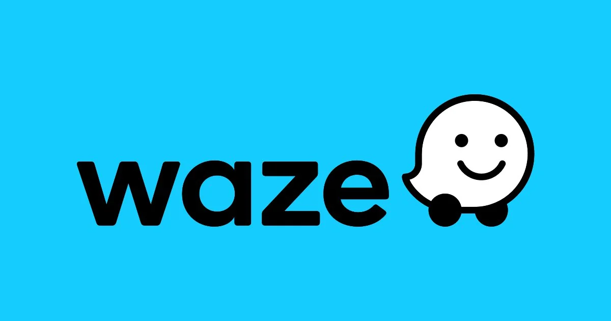

# Waze Project

## Waze Churn Prediction Model Project

 
**Note**: _This project is created in partnership between Google Advanced Data Analytics Professional Certificate and the real-time driving directions app, Waze. The story, all names, characters, and incidents portrayed in this project are fictitious. No identification with actual persons (living or deceased) is intended or should be inferred. And the data shared in this project has been created for pedagogical purposes._

## **Project Background**

Waze’s free navigation app makes it easier for drivers around the world to get to where they want to go. Waze’s community of map editors, beta testers, translators, partners, and users helps make each drive better and safer. Waze partners with cities, transportation authorities, broadcasters, businesses, and first responders to help as many people as possible travel more efficiently and safely.
Waze are about to start a new project to help prevent user churn on the Waze app. Churn quantifies the number of users who have uninstalled the Waze app or stopped using the app. This project focuses on monthly user churn. 
This project is part of a larger effort at Waze to increase growth. Typically, high retention rates indicate satisfied users who repeatedly use the Waze app over time. Developing a churn prediction model will help prevent churn, improve user retention, and grow Waze’s business. An accurate model can also help identify specific factors that contribute to churn and answer questions such as: 
-	Who are the users most likely to churn?
-	Why do users churn? 
-	When do users churn?
  
## **Scenario 1**

As a data analyst, I will collaborate with my Waze teammates to analyse and interpret data, generate valuable insights, and help leadership make informed business decisions. In my role, I will analyse user data and develop a machine learning model that predicts user churn. 
The insights that the team and I generate will help Waze leadership optimise the company’s retention strategy, enhance user experience, and make data-driven decisions about product development.
For my first assignment, I will be creating a project proposal that will create milestones for the tasks within this project.

**Team members at Waze**

As a new data analyst, I’ll work closely with a talented team of experienced data professionals. I’ll also collaborate with Waze co-workers outside the data team as the project requires. 

**Data team roles**
-	Harriet Hadzic - Director of Data Analysis 
-	May Santner - Data Analysis Manager 
-	Chidi Ga - Senior Data Analyst 
-	Sylvester Esperanza - Senior Project Manager 

**Other roles**
-	Emrick Larson - Finance and Administration Department Head 
-	Ursula Sayo - Operations Manager 

**Workflow Structure**

I will be using the PACE workflow framework throughout this project in order to provide a clear foundation and structure for this data analysis project. PACE is an acronym and each one of the letters represents an actionable stage in a project: plan, analyse, construct, and execute.

 
**Plan Stage**: First, I need to ask and answer some relevant questions for this project. These include:
-	Who is my audience for this project? My audience for this project includes my data team members, as well as the other team members I would be working with.
-	What am I trying to solve or accomplish? And what do I anticipate the impact of this work will be on the larger needs of the client? In this project, we aim to develop a machine learning model to predict user churn on the Waze app by analysing user data and identifying key factors that lead to churn. The impact will be improved user retention, enhanced user experience, and increased business growth through data-driven decision-making and targeted interventions. This will help Waze maintain a competitive edge and support long-term business success.
-	What questions need to be asked or answered? These include:
  
   -	What are the specific goals and objectives of the churn prediction project?
   -	What is the condition of the provided dataset?
   -		What variables will be the most useful?
   -		Are there trends within the data that can provide insight?
   -		What steps can I take to reduce the impact of bias?
   -		Are there any data quality issues or gaps that need to be addressed?
   -		How will data from different sources be integrated and preprocessed?
   -		What data governance and privacy considerations need to be taken into account?
   -		What initial insights can be gained from the data through Exploratory Data Analysis?
   -		Are there any patterns or trends in the data that need further investigation?
   -		What machine learning algorithms will be used to develop the churn prediction model?
   -		How will we split the data for training and testing the model?
   -		What metrics will be used to evaluate the model's performance?
   -		How will we ensure the model meets the project requirements?
   -		What techniques will be used to validate the model's accuracy and reliability?
   -		How will the model be tested for consistency and robustness?
   -		What are the key factors contributing to user churn?
   -		Who are the users most likely to churn?
   -		What strategies can be implemented to prevent churn and improve user retention?
   -		What type of reports and visualizations will be created to communicate findings?
   -		How will we tailor communication for different stakeholders, including technical and non-technical audiences?
   -		What are the main talking points for the presentation to the leadership team?
   -		What are the key milestones and deadlines for this project?

-	What resources are required to complete this project?
  
   - Team members
   - Input from stakeholders
   - Budget/Funding
   - Project Dataset
   - A statistical tool – e.g., Python (Python notebook)

-	What are the deliverables that will need to be created over the course of this project?
  
   - A project proposal
   - Prepared and cleaned datasets
   - Statistical model
   - Regression analysis model
   - Machine learning model
   - Exploratory Data Analysis reports
   - Stakeholder reports
   - Visualizations e.g. dashboard

[Link to Waze Project Proposal](assets/Waze_project_proposal.pdf)

